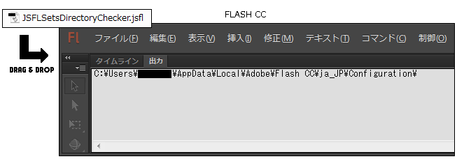

Linkage
=======

This is a jsfl file which sets up and cancels a linkage setup by package to each symbol in the selected folder.

Flash CC ライブラリ内、選択したフォルダ内の 各シンボルに対し、リンケージ設定を一括で設定・解除する JSFL を配置しています。HTML5 Canvas ドキュメント向け JSFL も用意しています。

## Download

* [LinkageForFlash.jsfl](https://raw.github.com/siratama/Linkage/master/download/LinkageForFlash.jsfl)
* [LinkageForHTML5Canvas.jsfl](https://raw.github.com/siratama/Linkage/master/download/LinkageForHTML5Canvas.jsfl)
* [LinkageCancel.jsfl](https://raw.github.com/siratama/Linkage/master/download/LinkageCancel.jsfl)
* [JSFLSetsDirectoryChecker.jsfl (option)](https://raw.github.com/siratama/Linkage/master/download/JSFLSetsDirectoryChecker.jsfl)

Windows の場合、右クリックから「リンク先のコンテンツを保存」を選択で保存できます。

When you do not know the placement directory of JSFL, please download JSFLSetsDirectoryChecker.jsfl.

JSFL ファイルの配置場所がわからない方は JSFLSetsDirectoryChecker.jsfl のファイルもダウンロードしてください。

## Installation

The placement directory of JSFL is displayed by an output window when you drag and drop JSFLSetsDirectoryChecker.jsfl in Flash CC.

JSFL ファイル配置場所(Configuration ディレクトリ)は、Flash CC 上に JSFLSetsDirectoryChecker.jsfl をドラッグ＆ドロップして実行する事で、出力ウインドウに表示されます。

Please locate each jsfl file as follows.

各 jsfl ファイルは以下のように配置してください。

	Configuration/
	　└ Commands/
	　　　├ LinkageForFlash.jsfl
	　　　├ LinkageForHTML5Canvas.jsfl
	　　　└ LinkageCancel.jsfl

LinkageForFlash, LinkageForHTML5Canvas, LinkageCancel is displayed in a command menu by placing it definitely.

正しく配置が行われると、Flash CC メニュー[コマンド]内に LinkageForFlash, LinkageForHTML5Canvas, LinkageCancel の項目が表示されます。