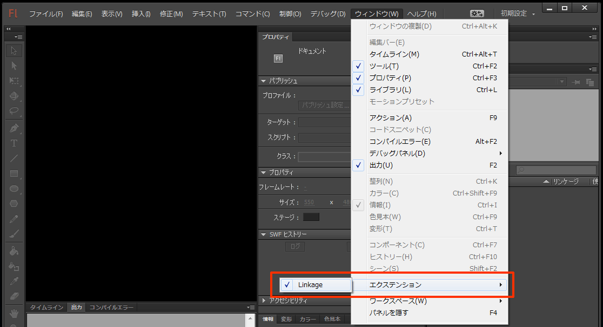
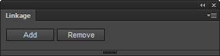
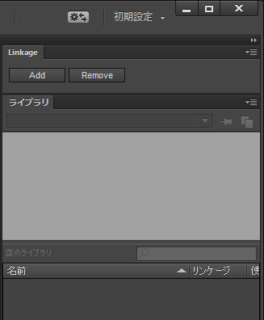

Linkage
=======

This is a jsfl file which sets up and cancels a linkage setup by package to each symbol in the selected folder.

Flash CC ライブラリ内、選択したフォルダ内の 各シンボルに対し、リンケージ設定を一括で設定・解除する JSFL を配置しています。
HTML5 Canvas ドキュメントにも対応しています。

---
## Download (Flash Pro CC 13.1 or later)

* [Linkage.zxp](https://raw.github.com/siratama/Linkage/master/download/Linkage.zxp)

This can be used by Flash CC 13.1 or later. In the case of Windows, it can save from a right-click. 
[Extension Manager Command Line tool(ExManCmd)](https://www.adobeexchange.com/resources/28) is required in order to install. 

Flash CC 13.1 以降のバージョンで利用可能です。Windows の場合、右クリックから「リンク先のコンテンツを保存」を選択で保存できます。
インストールには別途 [Extension Manager Command Line tool(ExManCmd)](https://www.adobeexchange.com/resources/28)が必要です。

## Installation

After installation of Adobe Extension Manager CC, if Linkage.zxp is double-clicked, installation of Linkage will begin. If Flash CC is rebooted after the completion of installation, Linkage will be displayed on the item of extension in window menu. 

Adobe Extension Manager CC インストール後、Linkage.zxp をダブルクリックする事で、Linkage インストール作業が行われます。インストール完了後 Flash CC を再起動し、メニュー「ウインドウ」->「エクステンション」内に「Linkage」の項目が表示されます。

Selection of the item of Linkage will display the following panels. By pushing Add button, linkage is set to all the symbol in the symbol chosen or a folder. Linkage setup is canceled by pushing Remove button.

Linkage の項目を選択すると、以下のパネルが表示されます。「Add」ボタンを押すとライブラリ内で選択されているシンボル、あるいはフォルダー内全てのシンボルにリンケージ設定がなされます。「Remove」ボタンを押すとリンケージ設定が解除されます。

If you install a panel on a library window, it is convenient. 

パネルはライブラリウインドウの上部に配置しておくと便利です。

---
## Download (Flash Pro CS6 or lower)

* [Linkage.jsfl](https://raw.github.com/siratama/Linkage/master/download/Linkage.jsfl)
* [LinkageCancel.jsfl](https://raw.github.com/siratama/Linkage/master/download/LinkageCancel.jsfl)
* [JSFLSetsDirectoryChecker.jsfl (option)](https://raw.github.com/siratama/Linkage/master/download/JSFLSetsDirectoryChecker.jsfl)

This is JSFL which can be chosen from a command menu. It can use also from a shortcut key. 

コマンドメニューから選択可能な JSFL です。ショートカットキーに割り当てる事で、簡単に利用できます。Flash CC 13.1 以降でも利用可能です。Windows の場合、右クリックから「リンク先のコンテンツを保存」を選択で保存できます。

When you do not know the placement directory of JSFL, please download JSFLSetsDirectoryChecker.jsfl.

JSFL ファイルの配置場所がわからない方は JSFLSetsDirectoryChecker.jsfl のファイルもダウンロードしてください。

## Installation

The placement directory of JSFL is displayed by an output window when you drag and drop JSFLSetsDirectoryChecker.jsfl in Flash CC.

JSFL ファイル配置場所(Configuration ディレクトリ)は、Flash CC 上に JSFLSetsDirectoryChecker.jsfl をドラッグ＆ドロップして実行する事で、出力ウインドウに表示されます。

Please locate each jsfl file as follows.

各 jsfl ファイルは以下のように配置してください。

	Configuration/
	　└ Commands/
	　　　├ Linkage.jsfl
	　　　└ LinkageCancel.jsfl

LinkageForFlash, LinkageForHTML5Canvas, LinkageCancel is displayed in a command menu by placing it definitely.

正しく配置が行われると、Flash CC メニュー[コマンド]内に LinkageForFlash, LinkageForHTML5Canvas, LinkageCancel の項目が表示されます。